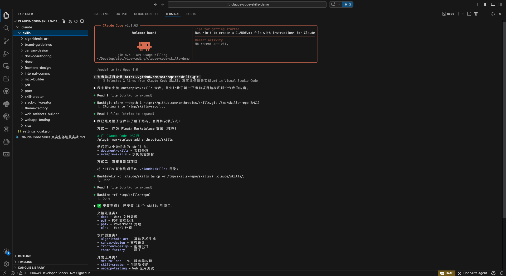
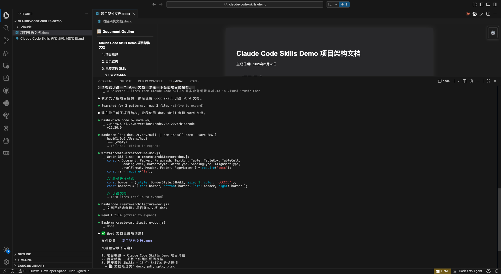
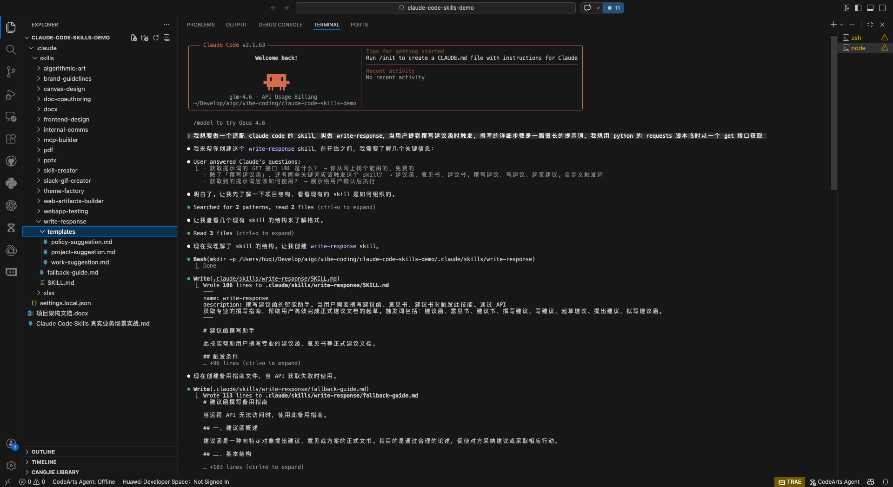
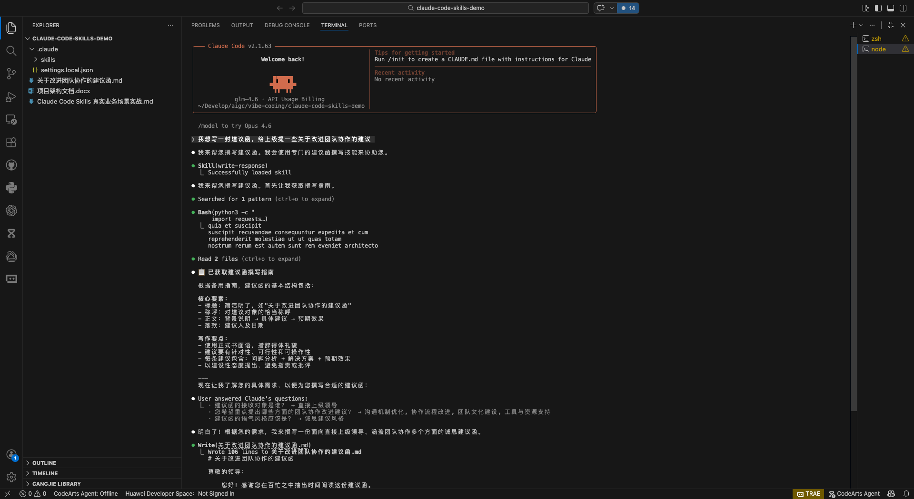

# Claude Code Skills 实战：从安装官方技能到自建企业级 Skill

> 10 分钟掌握 Claude Code 技能扩展，让 AI 助手拥有无限可能

看完 Datawhale 的公众号文章：[春节加餐：Anthropic 首个公开的 Skills 构建指南来了！](https://mp.weixin.qq.com/s/PcyKi5q8zT-tJ_9rzgKSqg)，相信这篇文章能给大家打下良好的理论基础。下面我们来点实际操作。

**本文你将学到：**
- 一键安装 Anthropic 官方 15 个 Skills
- 验证 Skill 是否正常工作
- 从零创建企业级 Skill（含动态提示词获取）

Anthropic 官方发布了 10 多个 skills，我们能不能直接拿过来用？答案是肯定的。我们先把官方发布的 skills 安装一下，然后再自己动手做一个 skill。这样，有现成的就安装现成的，找不到现成的就自己做一个。

# 安装官方 skills 到项目目录

## 下载 Anthropic 官方仓库里的 skill

```bash
git clone https://github.com/anthropics/skills.git
```

然后把下载下来的 `skills` 文件夹中的 `skills` 子文件夹拷贝到项目根目录。需要注意，拷贝到项目根目录下的 `skills` 文件夹里应该是一个个具体 skill 文件夹，比如 `docx`、`pdf`、`pptx` 等。

然后借助 `openskills` 管理所有 skills。先确认 Node 版本，输入 `node -v`，需要 Node.js 20.6 或更高版本；如果版本太低，就去访问 [Node.js 官网](https://nodejs.org/) 下载新版本并安装。

然后进入项目根目录，输入：

```bash
npx openskills install ./skills
```

会输出：

```text
? Select skills to install
❯◉ algorithmic-art           59.8KB
◉ brand-guidelines          13.5KB
◉ canvas-design             5.3MB
◉ doc-coauthoring           15.8KB
◉ docx                      1.1MB
```

点空格，把所有 skill 都选中，让每个 skill 前面的小绿点亮起来，然后点 Enter，就会把这个 `skills` 目录下的 skill 都安装好。



```text
✔ Select skills to install brand-guidelines          13.5KB, canvas-design             5.3MB, doc-coauthoring
15.8KB, docx                      1.1MB, frontend-design           14.5KB, internal-comms            22.3KB, mcp-builder
122.4KB, pdf                       59.1KB, pptx                      1.1MB, skill-creator             224.2KB,
slack-gif-creator         43.9KB, theme-factory             141.2KB, web-artifacts-builder     45.4KB, webapp-testing
22.4KB, xlsx                      1.1MB
✅ Installed: brand-guidelines
✅ Installed: canvas-design
✅ Installed: doc-coauthoring
✅ Installed: docx
✅ Installed: frontend-design
✅ Installed: internal-comms
✅ Installed: mcp-builder
✅ Installed: pdf
✅ Installed: skill-creator
✅ Installed: slack-gif-creator
✅ Installed: theme-factory
✅ Installed: web-artifacts-builder
✅ Installed: webapp-testing
✅ Installed: xlsx

✅ Installation complete: 15 skill(s) installed

Read skill: npx openskills read <skill-name>
Sync to AGENTS.md: npx openskills sync
```

然后再输入 `npx openskills sync`，就会同步到项目中。这会生成一个 `AGENTS.md` 文件，用来维护所有已经注册的 skills。

```text
✔ Select skills to sync to AGENTS.md canvas-design             (project), doc-coauthoring           (project), docx
(project), frontend-design           (project), internal-comms            (project), mcp-builder
(project), pdf                       (project), pptx                      (project), skill-creator             (project),
slack-gif-creator         (project), theme-factory             (project), web-artifacts-builder     (project), webapp-testing
(project), xlsx                      (project)
✅ Added skills section to AGENTS.md (14 skill(s))
```

项目根目录会出现 `.claude` 文件夹（里面有 `skills` 文件夹），同时会出现 `AGENTS.md` 文件。这说明安装成功。然后拷贝到根目录下的 `skills` 文件夹就可以删掉了。

## 试用 skill：一键生成 Word 文档

安装完成后，我们来验证 Skill 是否正常工作。

在 Claude Code 对话框里输入：请帮我创建一个 Word 文档，总结一下当前项目的架构。

输入后，Claude Code 开始输出信息：

`docx` skill：

```text
Base directory for this skill: e:\Python\skills\.claude\skills\docx

# DOCX creation, editing, and analysis

## Overview

A .docx file is a ZIP archive containing XML files.

## Quick Reference
```

可见它把这个 `docx` skill 的内容都输出出来了。

接着它输出：现在我了解了项目架构，让我为您创建 Word 文档。

发现没有 `docx` 包，它又去安装：

```text
Bash Install docx package
```

安装完 `docx` 包，它就创建了 Word 文档。

继续输出：文档已成功创建。让我验证一下文件。

验证文件存在后，把刚才产生的中间文件以及安装的 Node 包都删了：

```text
Bash Clean up temporary files
```

最后输出：

```text
Word 文档已成功创建！文件位置：[project-architecture.docx](vscode-webview://0v1he0tl74de838utg8qkd3tdms0mk261l7apo1e4aru3aduhq7f/project-architecture.docx)

文档包含以下内容：

1. **项目概述** - 介绍 Claude Agent Skills 项目
2. **目录结构** - 包含 skills、spec、template、.claude 等文件夹说明
3. **技能分类** - 详细的技能分类表格：
   - 创意与设计类（6 个技能）
   - 开发与技术类（6 个技能）
   - 企业与通信类（2 个技能）
   - 文档技能类（4 个技能）
4. **技术实现细节** - 技能文件夹结构说明
5. **许可证与使用** - Apache 2.0 开源说明
6. **使用平台** - Claude Code、Claude.ai、Claude API
```



到此为止，我们已经安装好了官方发布的 skills，并验证可用。整个过程不到 5 分钟。

# 创建自己的 skill：企业级实践



接下来我们来创建一个自己的 skill，获得更大的自由度。

**为什么需要自建 Skill？**
- 企业内部有独特的业务流程
- 核心提示词需要集中管理和版本控制
- 触发条件需要定制化

其实创建 skill 也不需要亲自从零构建，我们可以让 DeepSeek 给出详细操作步骤。把这个提示词给到 DeepSeek：

```text
我想要做一个适配 claude code 的 skill，叫做 write-response，当用户提到撰写建议函时触发，撰写的详细步骤是一篇很长的提示词，我想用 python 的 requests 脚本临时从一个 get 接口获取。请告诉我详细操作步骤
```

DeepSeek 输出了操作步骤：根据你的需求，我设计了一个三层架构的 Skill：

```text
write-response-skill/              # Skill 根目录
├── SKILL.md                       # 核心指令（必需）
├── scripts/                       # 可执行脚本目录
│   └── fetch_prompt.py            # 从接口获取提示词的 Python 脚本
└── references/                    # 参考文档目录（可选）
    └── examples.md                # 建议函示例
```

就这样照着 DeepSeek 给的详细步骤去做即可，一般不会有什么问题。不过为了防止有些意外情况跑不通，这里还是把详细步骤贴出来。各位朋友如果按照 DeepSeek 的步骤能成功运行，就不需要看下面这些内容；如果自己按照 DeepSeek 的步骤出了问题，可以看看下面这些内容，或许能得到一些启发并修复。

## 第一步：创建 Skill 目录结构

```bash
# Linux 或 Mac 电脑
mkdir .claude/skills/write-response-skill
mkdir .claude/skills/write-response-skill/scripts
mkdir .claude/skills/write-response-skill/references

# Windows 电脑
mkdir .\.claude\skills\write-response-skill
mkdir .\.claude\skills\write-response-skill\scripts
mkdir .\.claude\skills\write-response-skill\references
```

## 第二步：编写核心指令文件 `SKILL.md`

在 `write-response-skill` 文件夹下创建一个空文件，名称必须严格为 `SKILL.md`。

写入以下内容：

````markdown
---
name: write-response-skill
description: 专业建议函撰写技能。当用户需要撰写、修改、润色各类建议函时触发。触发场景：(1)写建议函 (2)撰写建议信 (3)写推荐信 (4)写反馈意见 (5)写投诉建议 (6)写项目建议书 (7)需要正式建议函格式
---

# 建议函撰写专家技能

你是一个专业的建议函撰写专家，擅长根据用户需求生成高质量、得体、有效的建议函。

## 核心工作流程

### 首先：理解用户需求

1. **主动询问关键信息**（如果用户未提供）：
   - 建议函的类型（如：工作建议、改进建议等）
   - 建议的对象（如：上级、同事、客户、合作伙伴等）
   - 建议的核心内容（具体想提出什么建议）
   - 背景和原因（为什么提出这个建议）
   - 期望的语气（正式、温和、坚定、急切等）
2. **信息确认**：总结用户需求，确保理解准确。

### 然后：获取核心提示词

**关键步骤**：调用 `fetch_prompt.py` 脚本，从接口获取详细的建议函撰写提示词。

```bash
python scripts/fetch_prompt.py
```

这个脚本会从 GET 接口获取包含以下内容的专业提示词：

- 建议函的基本结构和格式要求
- 不同场景下的撰写技巧
- 语气和措辞的注意事项
- 常见问题和解决方案
````

## 第三步：编写 Python 脚本 `fetch_prompt.py`

我们在这里设计成通过 GET 接口获取核心提示词。这样做的原因是，在企业业务中，核心业务提示词需要反复打磨，并让每个人调用最新版本，以保证业务质量统一。

在 `write-response-skill/scripts` 下创建文件 `fetch_prompt.py`，写入以下内容：

```python
"""
建议函撰写指南获取脚本
从指定 HTTP GET 接口获取详细的撰写步骤
"""

import requests
import sys
import json


def fetch_prompt_from_api(arid):
    """
    从 API 获取建议函撰写指南
    请将下面的 URL 替换为你实际的接口地址
    """
    # TODO: 替换为你的实际 API 地址
    api_url = "http://192.168.0.123:8000/get_prompt/" + str(arid)

    try:
        # 发送 GET 请求
        response = requests.get(api_url, timeout=10)  # 10 秒超时

        # 检查响应状态
        response.raise_for_status()

        # 尝试解析 JSON 响应
        try:
            data = response.json()
            # 假设 API 返回格式是 {"prompt": "详细的提示词内容"}
            if isinstance(data, dict) and "varticle" in data:
                return data["varticle"]
            elif isinstance(data, dict) and "content" in data:
                return data["content"]
            elif isinstance(data, dict) and "data" in data:
                return data["data"]
            else:
                # 如果返回的是其他 JSON 结构，直接返回整个内容
                return json.dumps(data, ensure_ascii=False, indent=2)
        except json.JSONDecodeError:
            # 如果不是 JSON，返回纯文本内容
            return response.text

    except requests.exceptions.Timeout:
        return "错误：请求超时，请稍后重试。"
    except requests.exceptions.ConnectionError:
        return "错误：无法连接到 API 服务器，请检查网络。"
    except requests.exceptions.HTTPError as e:
        return f"错误：HTTP {response.status_code} - {response.reason}"
    except Exception as e:
        return f"错误：{str(e)}"


def main():
    """主函数：获取并输出提示词"""
    print("正在获取建议函撰写指南...\n", file=sys.stderr)

    prompt = fetch_prompt_from_api(360)

    # 输出获取到的提示词（这将是 Claude 接收到的内容）
    print(prompt)

    # 输出元信息到 stderr（不会影响 Claude 读取）
    print("\n提示词获取完成。", file=sys.stderr)


if __name__ == "__main__":
    main()
```

这个脚本可以测试一下，看是否正常：

```bash
python ./.claude/skills/write-response-skill/scripts/fetch_prompt.py
```

如果能输出提示词，就是正常的。

## 第四步：添加参考示例（可选）

创建 `references/examples.md`，添加一些建议函示例：

```markdown
# 建议函示例参考

## 示例 1：工作流程改进建议

**场景**：向上级提出优化部门工作流程的建议
关于优化部门工作流程的建议

尊敬的王经理：

您好！感谢您一直以来对我们工作的支持和指导。

在日常工作中，我发现当前的项目审批流程存在一些可以优化的环节，特提出以下建议：

一、现状分析
目前我们的项目审批需要经过三级审核，平均耗时 3-5 个工作日，
其中大部分时间消耗在文件传递和等待上。

二、改进建议

引入电子审批系统，将线下流程转为线上

设置审批时限，每个环节不超过 24 小时

建立自动提醒机制，避免流程卡顿

三、预期效果

审批周期缩短 50% 以上

工作效率显著提升

流程透明度增加

期待您的考虑和反馈。如有需要，我愿意提供更详细的方案说明。

此致
敬礼

张三
2026 年 2 月 27 日
```

这个例子可以根据实际情况调整，这里就先给一个示例。

## 第五步：运行同步命令

```bash
# 在项目根目录执行
npx openskills sync
```

这个命令会：

- 扫描 `./.claude/skills/` 目录下的所有技能。
- 更新项目根目录的 `AGENTS.md` 文件，生成 `<available_skills>` XML 块。
- 让 Claude Code 更容易发现你的新技能。

## 第六步：验证 Skill 是否加载成功

启动 Claude Code 并查看 Skill 是否被识别：

```bash
claude
```

然后在 Claude Code 中尝试触发这个 Skill：

```text
我想写一封建议函，给上级提一些关于改进团队协作的建议
```

Claude 应该会：

- 识别到你的请求与 Skill 描述匹配。
- 询问是否使用 `write-response-skill` Skill（第一次使用时）。
- 执行 `fetch_prompt.py` 获取详细指南。
- 基于获取的指南和你提供的信息生成建议函。



---

# 总结

恭喜你！现在你已经掌握了：

| 技能 | 掌握程度 |
|------|----------|
| 安装官方 Skills | ✅ 一键安装 15 个官方技能 |
| 验证 Skill 工作 | ✅ 通过 docx 技能实测 |
| 自建企业级 Skill | ✅ 动态提示词 + 自定义触发 |

**下一步建议：**
1. 探索其他官方 Skills：`pdf`、`pptx`、`xlsx` 等
2. 根据团队需求创建专属 Skill
3. 将 Skill 纳入团队协作流程

**相关资源：**
- [Anthropic Skills 官方仓库](https://github.com/anthropics/skills)
- [openskills 工具](https://www.npmjs.com/package/openskills)
- [Claude Code 官方文档](https://docs.anthropic.com/claude-code)
